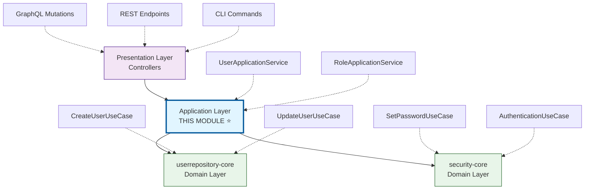
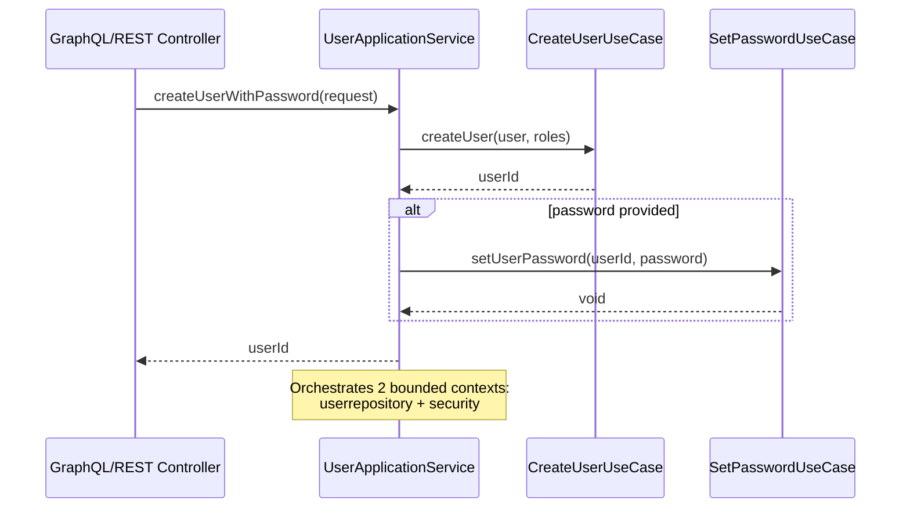
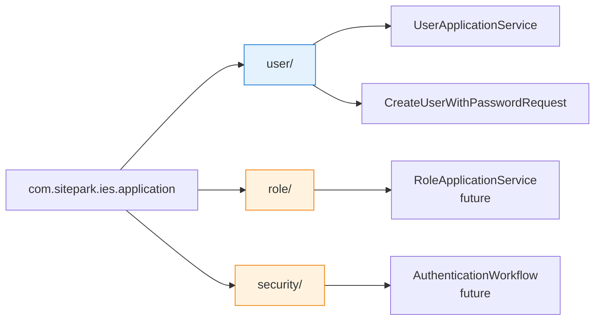
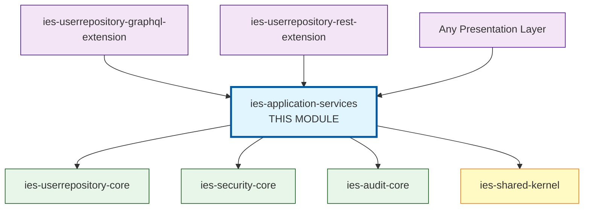

# IES Application Services

This module contains the **Application Layer** of the IES system, following Clean Architecture and Domain-Driven Design principles.

## Purpose

The Application Services layer orchestrates operations across multiple **Bounded Contexts** to implement complex business workflows. It acts as a coordination layer between the presentation layer (controllers) and the domain layer (use cases).

### Key Responsibilities

- **Use Case Orchestration**: Combines multiple use cases from different bounded contexts into a single transaction
- **Cross-Context Coordination**: Coordinates operations between `userrepository-core`, `security-core`, and other core modules
- **Workflow Management**: Implements complex multi-step business processes
- **Code Reusability**: Provides convenient APIs that can be shared across different presentation layers (GraphQL, REST, CLI)

## Architecture Position



## What Application Services Are NOT

❌ **Not Domain Logic**: Application Services do NOT contain business rules. Business logic belongs in Use Cases or Domain Entities.

❌ **Not Infrastructure**: They do NOT deal with databases, HTTP, or external systems. That's the job of the Infrastructure Layer (adapters).

❌ **Not Controllers**: They do NOT handle HTTP requests or GraphQL queries. That's the Presentation Layer.

## When to Use Application Services

### ✅ Use Application Services When:

- You need to **orchestrate multiple use cases** from different bounded contexts
- The same workflow is needed in **multiple controllers** (GraphQL + REST)
- You need to manage **transactional boundaries** across contexts
- You want to avoid **code duplication** between presentation layers

### ⛔ Do NOT Use Application Services When:

- You only call **one single use case** → Controllers can call use cases directly
- The operation is **bounded-context-specific** → Put it in the domain layer
- It contains **business logic** → That belongs in use cases or entities

## Example: User Creation with Password

### The Problem

User creation requires operations from **two different bounded contexts**:

1. **userrepository-core**: Create the user entity
2. **security-core**: Set the user's password

Without an application service, every controller would need to duplicate this orchestration:

```java
// ❌ BAD: Code duplication in GraphQL Controller
public String createUser(InputUser user, String password) {
  String userId = createUserUseCase.createUser(...);      // userrepository-core
  setPasswordUseCase.setPassword(userId, password);       // security-core
  return userId;
}

// ❌ BAD: Same code duplicated in REST Controller
public String createUser(UserDto dto) {
  String userId = createUserUseCase.createUser(...);      // userrepository-core
  setPasswordUseCase.setPassword(userId, dto.password()); // security-core
  return userId;
}
```

### The Solution

**Application Service** orchestrates the workflow **once**:



```java
// ✅ GOOD: Application Service (in THIS module)
public class UserApplicationService {

  public String createUserWithPassword(CreateUserWithPasswordRequest request) {
    // 1. Create user (userrepository-core)
    String userId = createUserUseCase.createUser(...);

    // 2. Set password (security-core)
    if (request.password() != null) {
      setPasswordUseCase.setUserPassword(...);
    }

    return userId;
  }
}

// ✅ GOOD: Controllers use the Application Service
// GraphQL Controller
public String createUser(InputUser user, String password) {
  return userApplicationService.createUserWithPassword(...);
}

// REST Controller
public String createUser(UserDto dto) {
  return userApplicationService.createUserWithPassword(...);
}
```

## Usage Example

### In Your Controller (GraphQL/REST/CLI)

```java
@Inject
private Provider<UserApplicationService> userApplicationServiceProvider;

public String createUser(InputUser inputUser, String password, List<Identifier> roles) {

  User user = InputUserTransformer.toUser(inputUser);

  return userApplicationServiceProvider
      .get()
      .createUserWithPassword(
          CreateUserWithPasswordRequest.builder()
              .user(user)
              .password(password)
              .roleIdentifiers(roles)
              .build());
}
```

## Module Structure



## Dependencies



**This module depends on:**

- **ies-userrepository-core** - User management domain
- **ies-security-core** - Security and authentication domain
- **ies-audit-core** - Audit logging (optional)
- **ies-shared-kernel** - Shared domain primitives

**This module is used by:**

- **ies-userrepository-graphql-extension** - GraphQL API
- **ies-userrepository-rest-extension** - REST API (if exists)
- Any other presentation layer that needs user workflows

## Design Principles

### Single Responsibility

Each application service focuses on **one area of functionality**:
- `UserApplicationService` → User-related workflows
- `RoleApplicationService` → Role-related workflows

### Thin Layer

Application services should be **thin orchestration layers**:
- ✅ Call use cases
- ✅ Pass data between contexts
- ✅ Handle transaction boundaries
- ❌ No business logic
- ❌ No validation (that's in use cases)
- ❌ No domain rules (that's in entities)

### Bounded Context Awareness

Application services are **allowed** to know about multiple bounded contexts. This is their purpose - to coordinate across contexts where controllers should not.

## Testing

Application services are tested with **mocked use cases**:

```java
@Test
void testCreateUserWithPassword() {
  // Mock the use cases
  when(createUserUseCase.createUser(any())).thenReturn("123");

  // Call application service
  String userId = service.createUserWithPassword(request);

  // Verify orchestration
  verify(createUserUseCase).createUser(any());
  verify(setPasswordUseCase).setUserPassword(any());
  assertEquals("123", userId);
}
```

See `UserApplicationServiceTest` for complete examples.

## References

### Clean Architecture (Robert C. Martin)

> "Use cases are the application-specific business rules. Application services orchestrate the flow between use cases."

### Domain-Driven Design (Eric Evans)

> "Application Services define the jobs the software is supposed to do. They orchestrate domain operations but contain no business logic themselves."

### Hexagonal Architecture (Alistair Cockburn)

> "The application layer coordinates domain operations. It's where you compose use cases to implement higher-level workflows."

## Related Modules

- **ies-userrepository-core** - Domain logic for user management
- **ies-security-core** - Domain logic for authentication/authorization
- **ies-userrepository-graphql-extension** - GraphQL presentation layer
- **ies-bootstrap** - Application startup and dependency injection

## Questions?

If you're unsure whether something belongs in an Application Service:

1. **Does it orchestrate multiple bounded contexts?** → Yes: Application Service
2. **Is it reused in multiple controllers?** → Yes: Application Service
3. **Does it contain business logic?** → No: Move to Use Case
4. **Is it a single use case call?** → No: Call use case directly from controller

---

**Remember**: Application Services are **orchestration**, not **implementation**. Keep them thin and focused on coordination.
